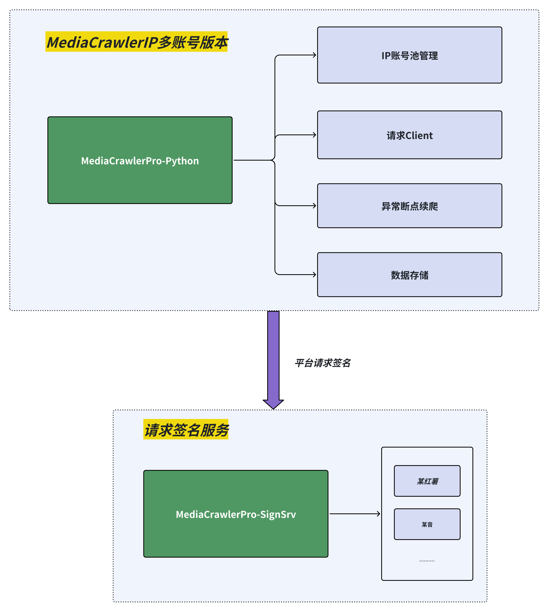

## 免责声明

本仓库的所有内容仅供学习使用，禁止用于商业用途。任何人或组织不得将本仓库的内容用于非法用途或侵犯他人合法权益。

我们提供的爬虫仅能获取抖音、快手、哔哩哔哩、小红书、百度贴吧、微博平台上**公开的信息**，

我们强烈反对任何形式的隐私侵犯行为。如果你使用本项目进行了侵犯他人隐私的行为，我们将与你保持距离，并支持受害者通过法律手段维护自己的权益。<br>

对于因使用本仓库内容而引起的任何法律责任，本仓库不承担任何责任。使用本仓库的内容即表示您同意本免责声明的所有条款和条件<br>

点击查看更为详细的免责声明。[点击跳转](#disclaimer)

## Pro版本诞生的背景
[MediaCrawler](https://github.com/NanmiCoder/MediaCrawler)这个项目开源至今获得了大量的关注，同时也暴露出来了一系列问题，比如：
- 能否支持多账号？
- 能否在linux部署？
- 能否去掉playwright的依赖？
- 有没有更简单的部署方法？
- 有没有针对新手上门槛更低的方法？
- 能不能提供可视化的界面操作？
- 能不能提供API的版本？
诸如上面的此类问题，想要在原有项目上去动刀，无疑是增加了复杂度，可能导致后续的维护更加困难。
出于可持续维护、简便易用、部署简单等目的，对MediaCrawler进行彻底重构。

## 项目介绍
### [MediaCrawler](https://github.com/NanmiCoder/MediaCrawler)的Pro版本python实现
**小红书爬虫**，**抖音爬虫**， **快手爬虫**， **B站爬虫**， **微博爬虫**，**百度贴吧**...。

支持多种平台的爬虫，支持多种数据的爬取，支持多种数据的存储，最重要的**完美支持多账号+IP代理池，让你的爬虫更加稳定**。
相较于MediaCrawler，Pro版本最大的变化：
- 去掉了playwright的依赖，不再将Playwright集成到爬虫主干中，依赖过重。
- 增加了Docker，Docker-compose的方式部署，让部署更加简单。
- 多账号+IP代理池的支持，让爬虫更加稳定。
- 新增签名服务，解耦签名逻辑，让爬虫更加灵活。

## 功能列表
| 平台   | 关键词搜索 | 指定帖子ID爬取 | 二级评论 | 指定创作者主页 | 账号池+IP代理池 | AI分析总结 |
|------|-------|----------|------|---------|-----------|-----------|
| 小红书  | ✅     | ✅        | ✅    | ✅       | ✅         |❌         |
| 微博   | ✅     | ✅        | ✅    | ✅       | ✅         |❌         |
| 百度贴吧 | ✅     | ✅        | ✅    | ✅       | ✅         |❌         |
| B 站  | ✅     | ✅        | ✅    | ✅       | ✅         |❌        |
| 抖音   | ✅     | ✅        | ✅    | ✅      | ✅         |❌         |
| 快手   | ✅     | ✅        | ✅    | ✅       | ✅         |❌         |


## 待办事项
- [x] 账号池管理 & 支持excel和mysql两种方式
- [x] 小红书爬虫重构
- [x] 微博爬虫重构
- [x] 百度贴吧爬虫重构
- [x] B站爬虫重构
- [x] 抖音爬虫重构
- [x] 快手爬虫重构
- [ ] AI分析总结


## Pro版本使用教程
> 在安装部署之前，请务必 [查看Pro的一些注意事项汇总](https://github.com/MediaCrawlerPro/MediaCrawlerPro-Python/issues/8)

视频部署教程： [B站：MediaCrawlerPro使用教程](https://space.bilibili.com/434377496/channel/series)

### 本地部署
> python推荐版本：3.9.6， requirements.txt中的依赖包是基于这个版本的，其他版本可能会有依赖装不上问题。
> 
> 相关依赖：nodejs（版本大于16），mysql，redis 在开始之前请确保你的电脑上已经安装了这些依赖。具体方法请自行谷歌或者百度。

#### 1、新建Pro版本目录
```shell
# 新建目录MediaCrawlerPro并进入
mkdir MediaCrawlerPro
cd MediaCrawlerPro
```

##### 2、克隆签名服务仓库并安装依赖
```shell
# 先克隆签名服务仓库并安装依赖
git clone https://github.com/MediaCrawlerPro/MediaCrawlerPro-SignSrv
cd MediaCrawlerPro-SignSrv

# 创建虚拟环境并安装签名服务的依赖，
python -m venv venv
source venv/bin/activate
pip install -r requirements.txt
```

##### 3、启动签名服务
本地安装签名服务时，需要nodejs环境，版本大于等于16以上
```shell
python app.py 
```

##### 4、克隆主项目仓库并安装依赖
```shell
# 再克隆主项目仓库
git clone https://github.com/MediaCrawlerPro/MediaCrawlerPro-Python.git

# 进入项目目录
cd MediaCrawlerPro-Python

# 创建虚拟环境 & 安装依赖
python -m venv venv
source venv/bin/activate
pip install -r requirements.txt
```
##### 5、配置账号池+IP代理信息
> 多账号管理基于cookies+IP配对，请按下方的配置说明进行配置，否则会导致爬虫无法正常运行。

Pro版本强烈推荐`IP代理+账号池`，代码层面基于这两者做了大量的重试机制来保障爬虫的稳定性。
配置文档见：[配置说明](config/README.md)

##### 6、配置数据存储方式
强力推荐使用数据库存储数据，使用`db存储`，代码层面有判断重复机制，如果是json和csv则没有。<br>
详细的介绍参见：[配置说明](config/README.md)


##### 6、启动主项目进行爬虫
搜索关键词以及其他的信息还是跟MediaCrawler的配置一样，在`config/base_config.py`中配置即可。
```shell
python main.py --platform xhs --type search
```

##### 7、查看数据
> 不再推荐你使用csv和json存储，存储效率慢，还做不到排重，使用mysql存数据非常方便和高效
数据存储在数据库中，可以通过数据库客户端查看数据。

### docker部署
```shell
# 新建目录MediaCrawlerPro并进入
mkdir MediaCrawlerPro
cd MediaCrawlerPro

# 先克隆签名服务仓库并构建镜像
git clone https://github.com/MediaCrawlerPro/MediaCrawlerPro-SignSrv
cd MediaCrawlerPro-SignSrv
docker build -t mediacrawler_signsrv . 

# 再克隆主项目仓库
git clone https://github.com/MediaCrawlerPro/MediaCrawlerPro-Python.git

# 进入项目目录
cd MediaCrawlerPro-Python

# 构建项目
docker-compose up --build  
```

## 两个仓库调用关系
> 拿xhs举例：在发起xhs平台某一个API请求前，我们需要一个x-s参数生成，原来在MediaCrawler中这部分逻辑是通过playwright去调用xhs它的window对象下的加密函数，然后生成x-s参数，
> 这部分逻辑是耦合在MediaCrawler中的，并且强制依赖playwright。

把请求签名的逻辑从原MediaCrawler中抽出去，做成一个单的服务（MediaCrawlerPro-SignSrv）还有好处就是：
后续如果主爬虫端不是python，而是换了一门语言，例如golang实现，我们也能很好的支持。 这就是解耦的好处，在软件工程中，解耦是一个很重要的概念，解耦后的代码更加灵活，更加容易维护。

调用关系图：
<div>
    
</div>

## 项目文件目录结构
```
MediaCrawlerPro-Python目录结构如下所示：
.  
├── base                                # 基础类目录  
│   └── base_crawler.py                 # 抽象类定义  
├── cmd_arg                             # 命令行参数目录
│   └── arg.py                          # 命令行参数解析  
├── config                              # 配置文件目录  
│   ├── README.md                       # 配置文件说明  
│   ├── accounts_cookies.xlsx           # excel账号池模板  
│   ├── base_config.py                  # 基础配置  
│   ├── db_config.py                    # 数据库配置  
│   ├── proxy_config.py                 # 代理配置  
│   └── sign_srv_config.py              # 签名服务配置  
├── constant                            # 常量目录  
│   ├── baidu_tieba.py                  # 百度贴吧常量  
│   ├── base_constant.py                # 基础常量  
│   ├── weibo.py                        # 微博常量  
│   └── xiaohongshu.py                  # 小红书常量  
├── media_platform                      # 平台爬虫实现目录  
│   ├── tieba                           # 百度贴吧爬虫实现  
│   │   ├── client.py                   # 贴吧客户端API  
│   │   ├── core.py                     # 主流程逻辑  
│   │   ├── field.py                    # 字段定义  
│   │   └── help.py                     # 辅助函数  
│   ├── weibo                           # 微博爬虫实现  
│   │   ├── client.py                   # 微博客户端API   
│   │   ├── core.py                     # 主流程逻辑  
│   │   ├── exception.py                # 异常定义处理  
│   │   ├── field.py                    # 字段定义  
│   │   └── help.py                     # 辅助函数  
│   └── xhs                             # 小红书爬虫实现  
│       ├── client.py                   # 小红书客户端API  
│       ├── core.py                     # 主流程逻辑  
│       ├── exception.py                # 异常定义处理    
│       ├── field.py                    # 字段定义  
│       └── help.py                     # 辅助函数  
├── model                               # 数据模型目录  
│   ├── m_baidu_tieba.py                # 百度贴吧数据模型  
│   ├── m_weibo.py                      # 微博数据模型  
│   └── m_xiaohongshu.py                # 小红书数据模型  
├── pkg                                 # 项目包目录  
│   ├── account_pool                    # 账号池目录  
│   │   ├── field.py                    # 字段定义  
│   │   └── pool.py                     # 账号池实现  
│   ├── cache                           # 缓存目录  
│   │   ├── abs_cache.py                # 缓存抽象类  
│   │   ├── cache_factory.py            # 缓存工厂  
│   │   ├── local_cache.py              # 本地缓存  
│   │   └── redis_cache.py              # redis缓存  
│   ├── proxy                           # IP代理目录  
│   │   ├── providers                   # IP代理提供商目录   
│   │   ├── base_proxy.py               # IP代理抽象类  
│   │   ├── proxy_ip_pool.py            # IP代理池实现  
│   │   └── types.py                    # IP代理类型定义  
│   ├── rpc                             # RPC目录  
│   │   └── sign_srv_client             # 签名服务客户端  
│   └── tools                           # 工具目录  
│       ├── crawler_util.py             # 爬虫工具函数  
│       ├── time_util.py                # 时间工具函数  
│       └── utils.py                    # 通用工具函数  
├── repo                                # 数据存储目录  
│   ├── accounts_cookies                # 账号池相关的存储  
│   │   └── cookies_manage_sql.py       # mysql账号池管理
│   └── platform_save_data              # 平台数据存储  
│       ├── tieba                       # 百度贴吧数据存储  
│       ├── weibo                       # 微博数据存储  
│       └── xhs                         # 小红书数据存储  
├── schema                              # 数据库表结构目录  
│   └── tables.sql                      # 数据库表结构  
├── static                              # 静态文件目录  
│   ├── img.png  
│   ├── img3.png  
│   ├── img4.png  
│   ├── img_1.png  
│   └── img_2.png  
├── test                                # 单元测试目录  
│   ├── test_expiring_local_cache.py    # 本地缓存测试  
│   ├── test_proxy_ip_pool.py           # IP代理池测试  
│   ├── test_redis_cache.py             # redis缓存测试  
│   └── test_utils.py                   # 工具函数测试  
├── Dockerfile                          # Dockerfile  
├── LICENSE                             # 开源协议  
├── README.md                           # 项目说明  
├── async_db.py                         # 异步数据库  
├── db.py                               # 数据库初始化  
├── docker-compose.yaml                 # docker-compose文件  
├── main.py                             # 程序入口  
├── mypy.ini                            # mypy配置  
├── requirements.txt                    # 依赖  
└── var.py                              # 上下文变量定义
```


## 免责声明
<div id="disclaimer"> 

### 1. 项目目的与性质
本项目（以下简称“本项目”）是作为一个技术研究与学习工具而创建的，旨在探索和学习网络数据采集技术。本项目专注于自媒体平台的数据爬取技术研究，旨在提供给学习者和研究者作为技术交流之用。

### 2. 法律合规性声明
本项目开发者（以下简称“开发者”）郑重提醒用户在下载、安装和使用本项目时，严格遵守中华人民共和国相关法律法规，包括但不限于《中华人民共和国网络安全法》、《中华人民共和国反间谍法》等所有适用的国家法律和政策。用户应自行承担一切因使用本项目而可能引起的法律责任。

### 3. 使用目的限制
本项目严禁用于任何非法目的或非学习、非研究的商业行为。本项目不得用于任何形式的非法侵入他人计算机系统，不得用于任何侵犯他人知识产权或其他合法权益的行为。用户应保证其使用本项目的目的纯属个人学习和技术研究，不得用于任何形式的非法活动。

### 4. 免责声明
开发者已尽最大努力确保本项目的正当性及安全性，但不对用户使用本项目可能引起的任何形式的直接或间接损失承担责任。包括但不限于由于使用本项目而导致的任何数据丢失、设备损坏、法律诉讼等。

### 5. 知识产权声明
本项目的知识产权归开发者所有。本项目受到著作权法和国际著作权条约以及其他知识产权法律和条约的保护。用户在遵守本声明及相关法律法规的前提下，可以下载和使用本项目。

### 6. 最终解释权
关于本项目的最终解释权归开发者所有。开发者保留随时更改或更新本免责声明的权利，恕不另行通知。
</div>
