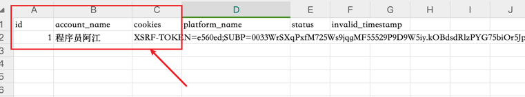
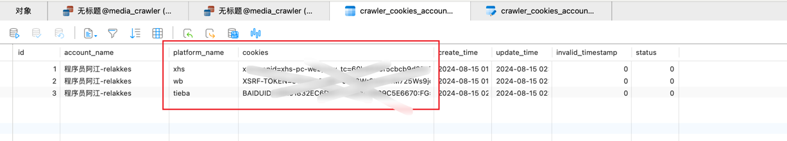
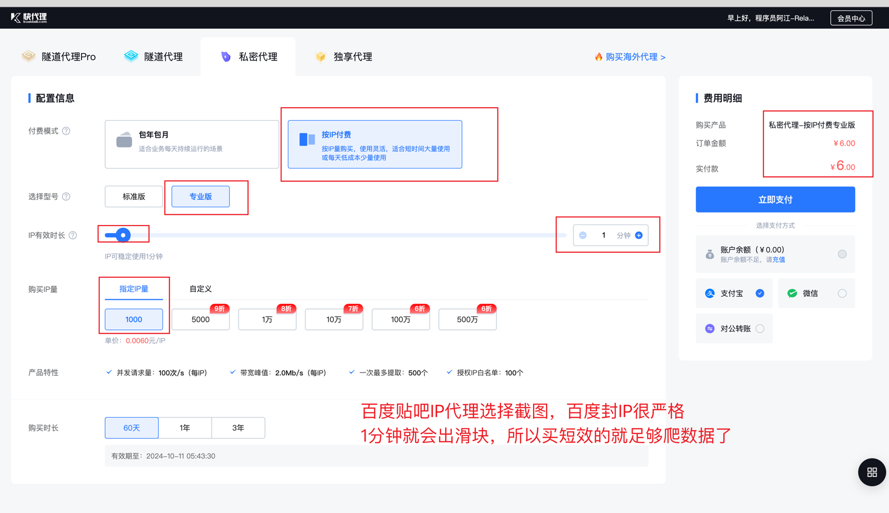
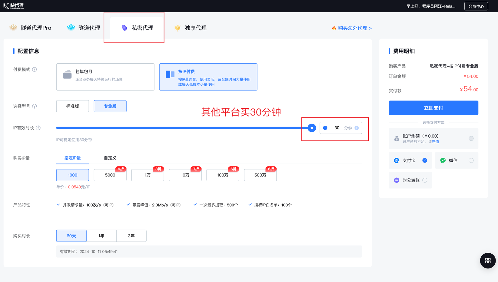

## 配置文件说明

### base_config.py
基础配置文件，包含了一些通用的配置项，如关键词参数、指定帖子ID、存储数据类型等 
每一个配置变量都标注的有中文注释，查看即可，这一部分跟MediaCrawler的配置是一样的

### 账号池管理
> 由于把Playwright移除了，所以登录大家自行在浏览器登录提取cookies放到`excel`或者`mysql`中。 
> 这里给大家一个cookies提取的谷歌插件，非常好用。[EditThisCookie](https://chromewebstore.google.com/detail/cookie-editor/hlkenndednhfkekhgcdicdfddnkalmdm)

#### excel存储账号信息
excel中的每一个sheet对应一个平台的账号列表信息，打开模板文件查看即可 
账号池文件，用于存储各个平台的账号信息，包括账号序号ID、账号名、登录成功的cookies以及其他（账号名和cookies必填） 
  

#### mysql存储账号信息
mysql中的每一个表对应一个平台的账号列表信息，表名为：`crawler_cookies_account`，定义在：schemas/tables.sql中  

#### 如何设置账号池存储类型
在`base_config.py`中设置`ACCOUNT_POOL_SAVE_TYPE`变量即可，支持`excel`和`mysql`两种存储类型，设置为`xlsx`即使用excel存储，设置为`mysql`即使用mysql存储

### 数据库配置
配置文件所在位置：`config/db_config.py` 

#### mysql数据库配置
数据存储选择mysql时，需要配置mysql数据库的连接信息，包括数据库地址、数据库端口、数据库名、数据库用户名、数据库密码
- 强力推荐使用`mysql`存储数据，因为`mysql`的数据存储更加稳定，高效，后期可以基于元数据进行更多的数据分析和数据挖掘
- 默认程序启动时会自动初始化数据库表结构，不需要手动创建表结构，程序会自动创建表结构
- 如果需要手动创建表结构，可以参考schemas/tables.sql文件，里面包含了所有的表结构信息

#### redis数据库配置
redis数据库配置，用于配置redis数据库的连接信息，包括redis地址、redis端口、redis密码、redis数据库名等信息
- redis数据库主要用于缓存IP代理池信息，用于IP代理的管理，不需要手动操作，程序会自动进行IP代理的管理

### proxy_config.py
IP代理池配置文件，用于控制IP代理池信息，主要是IP代理池数量、IP代理池的类型、IP代理池提供商的账号密码等信息 
目前仓库集成了[快代理的API](https://www.kuaidaili.com/?ref=ldwkjqipvz6c)，可以直接使用，如果有其他IP代理提供商，需要自行实现对应的SDK API 
代码会自动进行代理IP的管理，不需要手动操作，只需要配置好即可，代码会自动进行IP的切换和重试，另外代码默认使用的缓存是Redis，所以需要安装Redis服务并设置好Redis的连接信息

#### 快代理代理说明
> 之前我也是薅免费的用，但是太不稳定了，现在买了私密代理，稳定性非常好，价格也非常便宜. 
> 购买**私密代理**即可，价格是最便宜的, 购买地址：[快代理](https://www.kuaidaili.com/?ref=ldwkjqipvz6c) 
> 有了快代理的私密代理订单之后，把订单中的四个参数填入到`proxy_config.py`中即可（这一步不知道怎么填的，可以看MediaCrawler中的[说明文档](https://github.com/NanmiCoder/MediaCrawler/blob/main/docs/%E4%BB%A3%E7%90%86%E4%BD%BF%E7%94%A8.md)）

经过我的大量测试，百度贴吧一个IP的存活时间是1分钟，所以购买快代理IP时，建议购买1分钟存活的IP，这样可以保证IP的稳定性，价格也非常便宜

其他平台，例如小红书和微博，我测试的30分钟没有问题，所以如果是这两者可以购买30分钟存活的IP，价格也非常便宜

### sign_config.py
签名服务配置文件，签名服务的地址、签名服务的端口等信息